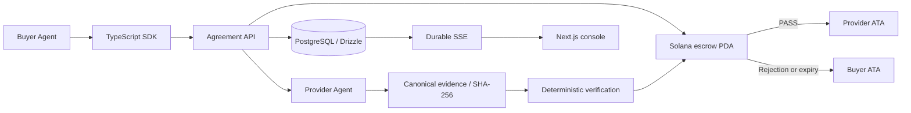

# ▧ ProofCommerce

**Trust & Settlement Infrastructure for Autonomous AI Agents**

> AI agents can spend money. ProofCommerce makes sure they only pay when the job is actually done.

Payments establish that money moved. They do not establish that the requested work was delivered. ProofCommerce separates payment authorization, evidence submission and settlement: discover a service, define requirements, escrow SPL tokens, commit evidence, verify and settle or refund.

**Validation status:** the application builds and its PostgreSQL-backed tests run on this Windows workspace. The Anchor source and real-chain test suite are implemented, but compilation, deployment and financial demos have **not yet been validated** here because Rust, Anchor, Solana and WSL are absent. Do not represent this as an already demonstrated on-chain MVP. See [the validation record](docs/VALIDATION.md).

The weather output is a deterministic fixture. Verification proves agreed structure, counts, freshness and hash integrity, **not weather accuracy**. `pcUSD — Test Stablecoin` is a six-decimal SPL test mint, not USDC or legal tender.

## Architecture



The MVP trusts a designated immutable verifier for each agreement. The program enforces authorities, terms, state and token movement; it cannot independently interpret an off-chain delivery. Development signers are disposable. See [architecture](docs/ARCHITECTURE.md), [protocol](docs/PROTOCOL.md) and [security](docs/SECURITY.md).

## Requirements

- Node.js 22+ and pnpm 10.32.1.
- PostgreSQL 17+ via Docker, an existing server or the portable PostgreSQL command.
- Financial demos: Rust, Anchor **0.32.1**, Solana/Agave **2.3.0**, on Linux/macOS or Windows WSL. Follow the [official installation instructions](https://www.anchor-lang.com/docs/installation), pinning `Anchor.toml` versions. The project intentionally uses the Anchor 0.32 ABI.
- Disposable wallets with test SOL for rent/fees. No paid AI API is required.

## Quickstart: application

Run from the repository root. PowerShell uses `Copy-Item .env.example .env` instead of `cp`.

```sh
pnpm install --frozen-lockfile
cp .env.example .env
pnpm db:start
pnpm db:migrate
pnpm db:seed
pnpm dev
```

Without Docker, run `pnpm db:portable` in a separate terminal instead of `pnpm db:start`. It runs real persistent PostgreSQL at `.local/postgres`, bound to loopback, with credentials matching `.env.example`.

Open **http://localhost:3000/dashboard**. Health: **http://127.0.0.1:4000/health**. The console includes marketplace search, service requirements, agents, reputation, agreements, evidence and timelines. Missing escrow configuration is visible and prevents purchases.

## Complete local Solana setup

After database setup, keep this running in a second terminal:

```sh
pnpm solana:local
```

Then run:

```sh
pnpm keys:create
pnpm chain:deploy
pnpm token:create
pnpm dev
```

`chain:deploy` creates an ignored program keypair, synchronizes the public program ID in Rust and `Anchor.toml`, invokes `anchor build`, deploys and writes `PROOFCOMMERCE_PROGRAM_ID` to `.env`. The checked-in initial program ID is a build placeholder, **not a deployed address**. Commit the public ID when choosing a persistent deployment.

`token:create` airdrops test SOL, creates a six-decimal SPL mint if none is configured, creates participant ATAs, mints test tokens to the buyer, and updates `.env` plus the buyer mint allowlist. Restart API processes after changes. Seed can run before the validator; it creates identities/services only.

```sh
pnpm test:chain
pnpm demo:success
pnpm demo:failure
pnpm demo:buyer
```

Success must print a real confirmed signature. Failure must print expected seven / received five, blocked settlement and a confirmed refund. Both exit nonzero without a configured chain. Standalone providers run with `pnpm provider:weather` and `pnpm provider:malicious`; the integrated demo invokes the same provider function in process.

Do not reset the validator while retaining an old mint/program/database as if it were the same chain. Use a fresh database and configuration for a new ledger.

## Devnet

Set `SOLANA_NETWORK=devnet`, `SOLANA_RPC_URL=https://api.devnet.solana.com`, and clear mint/program IDs from any local ledger. Use a separate database. Run `chain:deploy` and `token:create`. Faucet rate limits may require pre-funding generated public wallets with test SOL. The documented workflow does not support mainnet.

Devnet signatures link to Solana Explorer. Local signatures are displayed as local records, never linked as devnet transactions.

## x402 V2

x402 is instant pay-per-request interoperability, separate from ProofCommerce Verified Escrow. No custom scheme is advertised. The adapter delegates verification and settlement to reference `@x402/svm` code and explicitly prices the test mint.

After real-chain/token setup, run these in separate terminals:

```sh
pnpm x402:facilitator
pnpm x402:server
pnpm demo:x402
```

The loopback facilitator allowlists network/mint/recipient/amount and uses the operator wallet for fees. The client caps its amount before signing. Local CAIP-2 is derived from the validator genesis; devnet uses `solana:EtWTRABZaYq6iMfeYKouRu166VU2xqa1`. Headers: `PAYMENT-REQUIRED`, `PAYMENT-SIGNATURE`, `PAYMENT-RESPONSE`. See [x402 details](docs/X402.md) and the [official guide](https://solana.com/docs/payments/agentic-payments/x402). The handshake is tested; paid settlement awaits real-chain validation.

## SDK

```ts
import { ProofCommerce } from "@proofcommerce/sdk";
const client = new ProofCommerce({
  baseUrl: "http://127.0.0.1:4000",
  network: "localnet",
  demo: true,
});
const result = await client.buy({
  service: "weather-7d",
  requirements: { city: "Lima", country: "PE", days: 7 },
  maxPrice: "0.05", // decimal strings, bigint financial arithmetic
  idempotencyKey: "my-persistent-job-001",
});
```

One-call orchestration uses authorized demo identities. Outside demo mode, buyer/provider/verifier use separate sessions and their authorized endpoints. SDK `SessionSigner.signMessage()` handles login; server `AgentSigner.signTransaction()` is a separate interface. An external wallet session does not grant the backend possession of its transaction signer. [API/SDK reference](docs/API.md).

## Verification commands

```sh
pnpm lint
pnpm typecheck
pnpm test                     # migrated PostgreSQL required
pnpm build
pnpm exec playwright install chromium
pnpm test:e2e                 # chain cases explicitly skipped by default
pnpm chain:build
pnpm test:chain               # deployed/funded chain required; never silently skips
E2E_CHAIN=true pnpm test:e2e
```

PowerShell: `$env:E2E_CHAIN='true'; pnpm test:e2e`. API integration tests inject a labeled ledger double inside `tests/` only. They prove orchestration/database behavior, not Rust correctness. Real-chain tests send actual attacks and check SPL balances.

## Repository

```text
apps/api/                 Express, wallet sessions, workflow, Drizzle, migrations
apps/web/                 Next.js, Tailwind, Radix/shadcn-style components, console
programs/proofcommerce/   Anchor escrow and Rust tests
packages/shared/          Schemas, state machine, policy, reputation
packages/solana/          AgentSigner, isolated Anchor-compatible web3 adapter
packages/verifier/        Deterministic checks, canonical hash, optional LLM advice
packages/sdk/             Typed agent API client
packages/x402/            V2 exact-SVM adapters
examples/                 Weather, malicious weather, buyer, x402 service/facilitator
scripts/                  Database, keys, mint, deployment and demos
tests/                    Domain/API/x402, real-chain attacks, Playwright
docs/                     Protocol, security, deployment, Colosseum materials
.github/workflows/        Application CI and separate blockchain CI
```

## Configuration

Copy [.env.example](.env.example). Financial execution requires `DATABASE_URL`, `SOLANA_RPC_URL`, `SOLANA_NETWORK`, `PROOFCOMMERCE_PROGRAM_ID`, `PAYMENT_TOKEN_MINT`, buyer/provider/verifier signer paths and `VERIFIER_PUBLIC_KEY`. The setup scripts fill public mint/program/verifier values. `NEXT_PUBLIC_API_URL` is provided at web build time; `CORS_ORIGIN` must exactly match the web origin. `DEMO_MODE=true` enables local actors and is blocked under `NODE_ENV=production`.

Optional: `PROVIDER_ALLOWED_ORIGINS`, `X402_FACILITATOR_URL`, `X402_RESOURCE_URL`, `LLM_PROVIDER`, `LLM_BASE_URL`, `LLM_MODEL`, `LLM_API_KEY`. The Ollama-compatible LLM adapter is advisory and never authorizes settlement. No secrets belong in `NEXT_PUBLIC_*` settings. Setup scripts currently use `.local/keys/operator.json` for operator signing.

## Deployment, business and roadmap

Web: Vercel or Next standalone. API: [Dockerfile](Dockerfile), compatible with container hosts. DB: PostgreSQL. See [deployment instructions](docs/DEPLOYMENT.md). Do not host DEMO_MODE with real assets. Use independently constrained signing adapters, tenant-aware authorization, durable long-range transaction reconciliation and audited upgrade governance before production.

No protocol fee is collected. The conceptual 0.25% hypothesis and future Protocol/SDK/Cloud products are in [BUSINESS.md](docs/BUSINESS.md).

Roadmap: decentralized verification, consensus, MCP, A2A, production stablecoins, confidential payments, cross-chain, arbitration, ZK proofs and enterprise policies. These are not implemented claims.

[Colosseum draft](docs/COLOSSEUM.md) · [Demo runbook](docs/DEMO.md) · [Pitch](docs/PITCH.md) · [Technical video](docs/DEMO_VIDEO.md)

Submission URL and public repository URL: **pending publication**. Set `NEXT_PUBLIC_GITHUB_URL` to show the repository link on the landing page.

License: [MIT](LICENSE).
