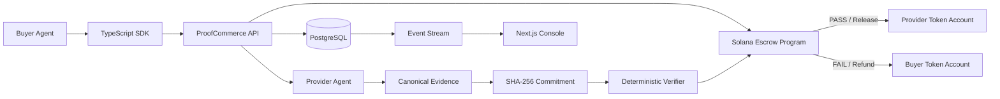

# ▧ ProofCommerce

### Proof before payment for autonomous AI agents.

**ProofCommerce is trust and settlement infrastructure for agent-to-agent commerce.**

AI agents can discover services, call APIs and spend money. The missing piece is knowing whether the requested work was actually delivered before funds are released.

ProofCommerce separates **payment authorization**, **delivery evidence**, **verification**, and **settlement**.

A buyer agent defines a job and locks funds in a Solana escrow. The provider executes the service and submits cryptographically committed evidence. ProofCommerce verifies the delivery against the agreed requirements and only then releases payment.

If verification fails, settlement is blocked and the buyer can recover the funds.

---

## Live Demo

**Application:** https://proofcommerce.vercel.app
**Marketplace:** https://proofcommerce.vercel.app/marketplace
**Dashboard:** https://proofcommerce.vercel.app/dashboard
**API Health:** https://proofcommerce.vercel.app/api/health
**Source Code:** https://github.com/rosario1709/CriptoWorldsFair

### Solana Devnet

**Program ID**

```text
GwhBjtoAfoenUgtNGr4iEpCGMke75bYHQ5vN5mqeWyem
```

**pcUSD test mint**

```text
DWatwzfq8RopVFsEXoEuzV77SjNtbL3yWYnJhamzWaC5
```

`pcUSD` is a six-decimal SPL test token created for the prototype. It is not USDC, fiat currency, or legal tender.

---

## The Problem

Payments prove that money moved.

They do not prove that:

- the requested work was completed;
- the response matched the agreement;
- the submitted evidence was not modified;
- the correct provider performed the job;
- the delivery satisfied the buyer's requirements.

This becomes especially important when autonomous agents buy services from other autonomous agents.

Traditional payment infrastructure solves transfer.

**ProofCommerce adds verifiable conditional settlement.**

---

## How It Works

```text
Buyer Agent
     │
     ▼
Discover Service
     │
     ▼
Define Requirements
     │
     ▼
Create Agreement
     │
     ▼
Lock pcUSD in Solana Escrow
     │
     ▼
Provider Executes Service
     │
     ▼
Submit Canonical Evidence
     │
     ▼
SHA-256 Commitment
     │
     ▼
Deterministic Verification
      ┌─────────────┴─────────────┐
      ▼                           ▼
    PASS                         FAIL
      │                           │
      ▼                           ▼
Release Payment             Block Settlement
      │                           │
      ▼                           ▼
Provider Paid                 Refund Buyer
```

The protocol flow is:

```text
discover → agree → escrow → execute → prove → verify → settle/refund
```

---

## Public Devnet Proof

ProofCommerce has been deployed and exercised on **Solana Devnet**.

### Successful Settlement

A buyer requested a seven-day weather dataset for Lima, Peru.

The provider returned evidence satisfying the agreement:

- correct schema;
- city: Lima;
- country: PE;
- seven consecutive days;
- fresh timestamp;
- matching canonical evidence commitment.

Verification passed and exactly **0.04 pcUSD** was released.

**Settlement transaction**

```text
8jDfxJnKbonKp84yv2etoq7uz8kJnZNnuLVXCvLYrkA9p1358bNoq2GMLhzkLr9bQ4sQrQwMLcQ8XFAA8v6vsA1
```

Solana Explorer:

https://explorer.solana.com/tx/8jDfxJnKbonKp84yv2etoq7uz8kJnZNnuLVXCvLYrkA9p1358bNoq2GMLhzkLr9bQ4sQrQwMLcQ8XFAA8v6vsA1?cluster=devnet

Confirmed result:

```text
Instruction: ReleasePayment
Status: Ok
Finalized
```

### Invalid Delivery and Refund

A malicious provider returned only **5 days** while the agreement required **7 days**.

ProofCommerce rejected the delivery.

```text
Expected:     7 days
Received:     5 days
Verification: REJECTED
Settlement:   BLOCKED
Result:       REFUND
```

**Refund transaction**

```text
2jWrcVwvF38KwXexi3mpgyzMf4kt2Rb87U3YLW1YRzcPm7pHaUsDScncJX2YXj8cb22yxQE6k6TwFbBtPCivpo7s
```

Solana Explorer:

https://explorer.solana.com/tx/2jWrcVwvF38KwXexi3mpgyzMf4kt2Rb87U3YLW1YRzcPm7pHaUsDScncJX2YXj8cb22yxQE6k6TwFbBtPCivpo7s?cluster=devnet

Confirmed result:

```text
Instruction: Refund
Status: Ok
Finalized
```

> A provider cannot receive the escrowed payment merely by claiming the job is complete.

---

## Architecture



### Hosted Architecture

```text
Browser
   │
   ▼
Vercel
Next.js Web
   │
   ▼
/api/*
Vercel Rewrite
   │
   ▼
Render
ProofCommerce API
   ├──────────► Neon PostgreSQL
   │
   └──────────► Solana Devnet
                    │
                    ▼
             ProofCommerce Program
```

The frontend uses a same-origin `/api` proxy through Vercel before forwarding requests to the hosted backend.

---

## What Is Verified?

The current public demo uses deterministic verification. For the weather service, ProofCommerce checks properties including schema, city, country, number of days, consecutive dates, timestamp freshness, canonical evidence hash, on-chain commitment, agreement state and authorized actors.

The weather output itself is a deterministic fixture. The demo proves that agreed delivery conditions can control financial settlement. It does **not** claim meteorological forecast accuracy.

---

## Trust Model

The current MVP uses a designated verifier associated with each agreement.

The Solana program enforces buyer authority, provider authority, verifier authority, payment mint, payment amount, escrow ownership, evidence commitment, agreement state, allowed state transitions, settlement destination, refund conditions, deadline behavior and replay protection.

The Solana program does not attempt to independently interpret arbitrary off-chain work. Instead, the verifier evaluates the agreed requirements and the on-chain program enforces settlement rules and token movement.

Future versions can extend this model with decentralized or consensus-based verification.

---

## Security Validation

The real-chain test suite exercises adversarial cases including wrong buyer, wrong provider, wrong verifier, wrong token mint, zero-value agreements, immutable agreement amounts, unauthorized funding, invalid state transitions, premature withdrawal attempts, invalid evidence hashes, unauthorized verification, wrong settlement destination, unauthorized settlement, double settlement, refund after settlement, rejected delivery refunds, expired agreements and account-substitution drain attempts.

Run the real-chain suite with:

```sh
pnpm test:chain
```

Chain tests require a deployed and funded Solana environment and do not silently downgrade financial execution to mocks.

---

## Product Surface

### Marketplace

Agents can discover services and inspect provider, price, category, verification method, availability and service requirements.

### Agreements

Each agreement exposes buyer, provider, requirements, price, escrow state, evidence, verification result, settlement state and transaction history.

### Dashboard

The dashboard provides visibility into active agreements, agent activity, settlements, refunds, events, network configuration and chain readiness.

### Agent SDK

The TypeScript SDK allows software agents to interact programmatically with ProofCommerce.

---

## SDK Example

```ts
import { ProofCommerce } from "@proofcommerce/sdk";

const client = new ProofCommerce({
  baseUrl: "http://127.0.0.1:4000",
  network: "localnet",
  demo: true,
});

const result = await client.buy({
  service: "weather-7d",
  requirements: {
    city: "Lima",
    country: "PE",
    days: 7,
  },
  maxPrice: "0.05",
  idempotencyKey: "my-persistent-job-001",
});
```

Financial amounts use decimal strings and bigint-compatible arithmetic rather than floating-point financial calculations.

---

## Repository Structure

```text
apps/
├── api/                 Express API, workflow and wallet sessions
└── web/                 Next.js marketplace and console

programs/
└── proofcommerce/       Anchor Solana escrow program

packages/
├── sdk/                 Typed ProofCommerce client
├── shared/              Schemas, policy and state machine
├── solana/              Solana integration and signing adapters
├── verifier/            Canonicalization and deterministic verification
└── x402/                x402 V2 interoperability adapters

examples/                Weather, malicious-provider, buyer and x402 demos
scripts/                 Database, wallet, token, deployment and demo tooling
tests/                   Domain, API, real-chain attack and Playwright tests
docs/                    Architecture, protocol, security, deployment and pitch material
```

---

## Technology Stack

**Blockchain:** Solana, Anchor 0.32.1, Rust, SPL Tokens
**Backend:** Node.js, TypeScript, Express, Drizzle ORM, PostgreSQL, Neon
**Frontend:** Next.js, React, TypeScript, Vercel
**Infrastructure:** Vercel, Render, Neon PostgreSQL, Solana Devnet

---

## Requirements

- Node.js 22+
- pnpm 10.32+
- PostgreSQL
- Rust
- Anchor 0.32.1
- Solana / Agave 2.3.0

On Windows, Solana development is expected to run through WSL.

---

## Quickstart

```sh
pnpm install --frozen-lockfile
cp .env.example .env
pnpm db:start
pnpm db:migrate
pnpm db:seed
pnpm dev
```

Without Docker:

```sh
pnpm db:portable
```

Application:

```text
http://localhost:3000
```

API health:

```text
http://127.0.0.1:4000/health
```

---

## Local Solana Setup

```sh
pnpm solana:local
pnpm keys:create
pnpm chain:deploy
pnpm token:create
pnpm dev
```

Run the real-chain test suite:

```sh
pnpm test:chain
```

Run the demo flows:

```sh
pnpm demo:success
pnpm demo:failure
pnpm demo:buyer
```

---

## Devnet Deployment

```text
SOLANA_NETWORK=devnet
SOLANA_RPC_URL=https://api.devnet.solana.com
```

Program:

```text
GwhBjtoAfoenUgtNGr4iEpCGMke75bYHQ5vN5mqeWyem
```

Payment token:

```text
DWatwzfq8RopVFsEXoEuzV77SjNtbL3yWYnJhamzWaC5
```

The public prototype targets Solana Devnet. It is **not presented as an audited mainnet financial protocol**.

---

## Verification Commands

```sh
pnpm lint
pnpm typecheck
pnpm test
pnpm build
pnpm exec playwright install chromium
pnpm test:e2e
pnpm chain:build
pnpm test:chain
E2E_CHAIN=true pnpm test:e2e
```

---

## x402 V2

ProofCommerce also contains experimental x402 V2 interoperability.

```text
x402
instant pay-per-request

ProofCommerce
escrow → delivery → verification → conditional settlement
```

The x402 integration is supplementary. **Verified Escrow is the core protocol demonstrated by the public ProofCommerce MVP.**

See [docs/X402.md](docs/X402.md).

---

## Public Deployment

```text
Frontend     Vercel
API          Render
Database     Neon PostgreSQL
Blockchain   Solana Devnet
```

Production frontend requests use:

```text
NEXT_PUBLIC_API_URL=/api
```

Vercel forwards these requests to the backend using `API_UPSTREAM_URL`.

Database credentials, wallet material and signer keys remain server-side. Secrets must never be stored in `NEXT_PUBLIC_*` variables.

---

## Current MVP Limitations

ProofCommerce is an experimental hackathon prototype.

Current limitations include:

- designated verifier per agreement;
- Solana Devnet instead of mainnet;
- test payment token;
- deterministic service examples;
- development signers;
- no decentralized verifier consensus;
- no production arbitration layer;
- no audited mainnet upgrade governance.

---

## Roadmap

Potential future work includes decentralized verification, multi-verifier consensus, MCP integrations, Agent-to-Agent protocol integrations, production stablecoins, arbitration, confidential payments, cross-chain settlement, zero-knowledge delivery proofs, enterprise authorization policies, and reputation and staking mechanisms.

---

## Business Model

The MVP currently collects no protocol fee.

Potential monetization includes settlement fees, agent infrastructure, verification services, analytics and enterprise policies.

An initial market wedge is deterministic digital services that autonomous agents can purchase and evaluate programmatically, including structured data, API execution, AI inference, translation, research and machine-generated digital work.

See [docs/BUSINESS.md](docs/BUSINESS.md).

---

## Why Solana?

ProofCommerce needs infrastructure suitable for machine-to-machine transactions.

Solana provides low transaction costs, fast settlement, programmable escrow, SPL token support, deterministic account ownership and composability with agent payment infrastructure.

The blockchain is not used to perform the provider's computation. It acts as the **neutral settlement layer controlling the escrowed assets**.

---

## Built for Colosseum Crypto World's Fair 2026

ProofCommerce was built as a submission for **Colosseum Crypto World's Fair 2026**.

The project demonstrates an end-to-end autonomous-commerce flow on Solana Devnet:

```text
Service Discovery
        │
        ▼
Agreement
        │
        ▼
Token Escrow
        │
        ▼
Provider Execution
        │
        ▼
Evidence Commitment
        │
        ▼
Deterministic Verification
        │
     ┌──┴──┐
     ▼     ▼
   Settle Refund
```

Stable submission snapshot:

```text
hackathon-submission-v3
```

---

## Documentation

- [Architecture](docs/ARCHITECTURE.md)
- [Protocol](docs/PROTOCOL.md)
- [Security](docs/SECURITY.md)
- [Deployment](docs/DEPLOYMENT.md)
- [Business](docs/BUSINESS.md)
- [Demo Runbook](docs/DEMO.md)
- [Pitch](docs/PITCH.md)
- [Technical Demo Video](docs/DEMO_VIDEO.md)
- [Colosseum Materials](docs/COLOSSEUM.md)

---

## Philosophy

Autonomous agents should not have to trust a provider simply because the provider says:

> The work is complete.

ProofCommerce makes the financial action depend on verifiable delivery.

### Proof before payment.

---

## License

[MIT](LICENSE)
