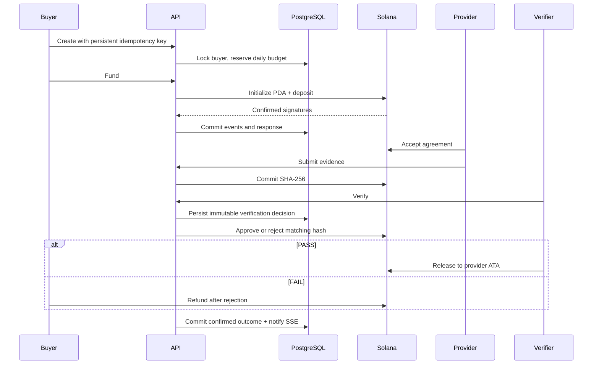

# Architecture

PostgreSQL is the workflow journal; Solana is the financial authority. Database balances are never used to move tokens. Web presentation, off-chain deliverables and immutable financial terms are separate.

| Component            | Responsibility                                                                                                         |
| -------------------- | ---------------------------------------------------------------------------------------------------------------------- |
| Next.js web          | Public identities, evidence, signatures and event timelines                                                            |
| Express API          | Zod validation, wallet sessions, policies, orchestration, idempotency                                                  |
| PostgreSQL/Drizzle   | Agents, embedded policies, provider services, agreements, evidence/verification history, payments, sessions and events |
| Verification journal | Decision/evaluation time committed before submitting chain approval                                                    |
| Solana adapter       | PDA derivation, Anchor ABI, transaction signing, confirmation/recovery                                                 |
| Anchor program       | Immutable terms, signer constraints, deadline/state checks, vault movement                                             |
| SDK                  | Typed API access and authorized local automation                                                                       |
| x402                 | Independent reference exact-SVM payment path                                                                           |

Users are wallet identities authenticated through sessions; providers are provider-capable agents. Policies are embedded in agent records. Reputation is derived from agreements rather than mutable counters.

## Consistency

Mutations take an idempotency advisory lock then an agreement row lock. Creation locks the buyer while reserving budget. Same-key changed input returns 409; different settlement keys serialize. Financial terminal states remain protected on-chain even across independent workers.

There is no distributed PostgreSQL/Solana transaction. After a crash, the adapter reads actual state and recovers a matching signature from the latest 50 PDA transactions. Initialization recovery works after funding too. Verification decisions are journaled separately so an already approved result is not reclassified as stale after a crash. Retry evidence must be identical under canonicalization. Pruned history or out-of-band state requires explicit reconciliation; no receipt is invented.

## Events

SSE uses LISTEN/NOTIFY and durable replay ordered by a sequence number. Notifications commit with workflow changes. `Last-Event-ID` resumes delivery and 20-second heartbeats keep connections alive. Dedicated listener connections do not consume the transaction pool. Browser reads refresh on events rather than aggressive polling.

## Compatibility

The Anchor 0.32.1 adapter encodes discriminators, little-endian arguments and account order explicitly. web3.js v1/SPL Token remain in the adapter/setup/chain tests; the x402 adapter uses its reference Kit signer. These transaction objects never reach browser code. The API Docker build bundles source modules but keeps external dependencies installed.
