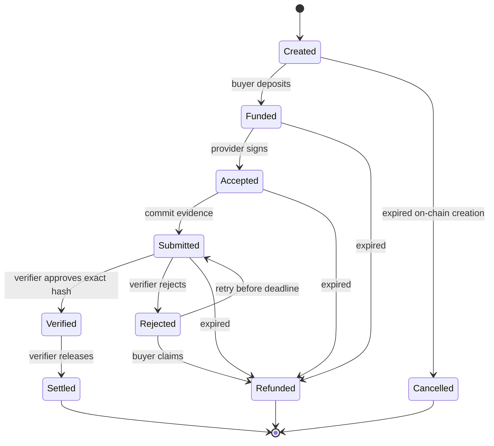

# ProofCommerce Verified Escrow v0.1

An **Agent** is a public-key identity with capabilities and policies. A **Service** advertises delivery and price. An **Agreement** binds buyer/provider/mint/amount/deadline/requirements. A **Requirement** specifies acceptable delivery. **Evidence** is untrusted JSON plus its canonical hash. **Verification** is a deterministic check report. **Settlement** transfers exact principal. **Reputation** aggregates terminal outcomes.

The API has reserved IN_PROGRESS, VERIFYING, EXPIRED and DISPUTED types; no arbitration authority is implemented. A never-initialized agreement can be cancelled in the database immediately. An initialized Created account uses `cancel_expired`.

## Minimal on-chain state

250 bytes including discriminator: hashed agreement ID, buyer/provider/mint/verifier keys, requirements hash, delivery hash, u64 amount, i64 deadline, state and bump. PDA seeds bind agreement ID, buyer, provider and mint. Its standard ATA holds tokens under PDA authority. Only six-decimal standard SPL tokens are accepted; Token-2022 extensions are outside scope.

Payloads, names, checks, services and logs stay off-chain for storage/search. Their hashes bind critical data to the chain. The program cannot verify semantic truth of JSON. The buyer selects a verifier distinct from both parties; providers must inspect this authority and terms before accepting. A malicious verifier can approve bad work or reject good work, but cannot redirect payment or change its amount.

## Deadline and liveness

Positive principal and a deadline within seven days are required. Funding, acceptance, delivery and approval must occur before expiry. Rejected work permits immediate refund or retry. Unverified expired work permits refund. Verified work cannot be refunded even after expiry; it remains payable, with liveness dependent on the verifier. No fees are deducted.

Accounts remain allocated after completion. There is no rent reclamation or sweep of unsolicited excess token donations. Only the immutable principal is transferred.

## Evidence and reputation

Canonicalization recursively sorts object keys, preserves arrays, accepts finite JSON values and serializes strings/numbers with JavaScript JSON semantics before UTF-8 SHA-256. Unsupported values are rejected. Cross-language clients must reproduce these semantics; no external JCS certification is claimed.

Completed jobs = SETTLED + REFUNDED. Passed = SETTLED. Failed = refunded jobs with FAIL verification. Score = rounded 100 × passed/completed. New agents are unrated. Volume sums settled base units. Average response time currently measures end-to-end agreement completion, not model inference alone. Rejected attempts remain in verification history even if a retry later succeeds.
