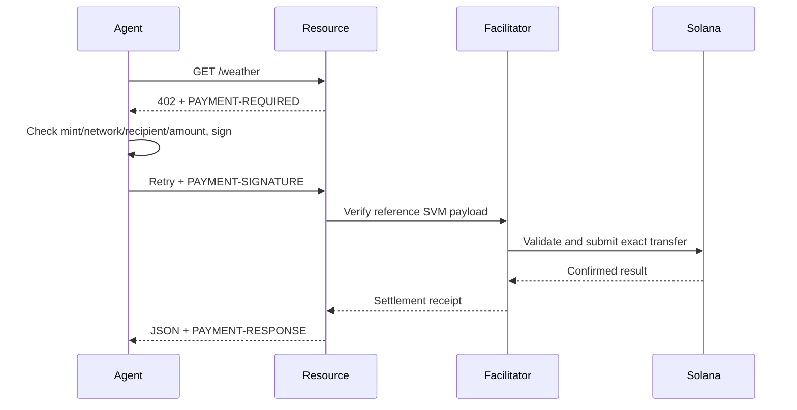

# x402 V2 interoperability

ProofCommerce Verified Escrow is an application protocol with delivery guarantees mediated by a designated verifier. The separate x402 adapter consumes ordinary exact-SVM pay-per-request resources. It does not modify the x402 specification or advertise a custom scheme.

The reference @x402/core, @x402/express, @x402/fetch and @x402/svm packages implement transport/payment semantics. There is no handwritten partial transaction verifier. The client rejects other versions, networks, assets, recipients, amounts above 40,000 units and timeouts above 120 seconds. Resource pricing is explicit `{amount:"40000",asset:PAYMENT_TOKEN_MINT,extra:{decimals:6}}`.

The development facilitator binds loopback, caps body size, rate-limits and allowlists the request. Its operator signer sponsors transaction fees. Reference settlement caching protects transaction replay within the running facilitator. This example is not suitable for multiple facilitator workers or restart-safe paid fulfillment without shared durable cache/request identities.

Devnet CAIP-2: `solana:EtWTRABZaYq6iMfeYKouRu166VU2xqa1`. Localnet derives its identifier from the genesis hash rather than falsely labeling a local transfer as devnet. No legacy V1 headers are used.

Run the three x402 commands documented in README after mint setup. The client requires `success` and a transaction in the decoded PAYMENT-RESPONSE, otherwise exits with failure. The reference HTTP 402 challenge is covered by Vitest; paid settlement awaits actual network execution in this environment.

Reference: [Solana x402 V2 guide](https://solana.com/docs/payments/agentic-payments/x402), [exact-SVM specification](https://github.com/x402-foundation/x402/blob/main/specs/schemes/exact/scheme_exact_svm.md).
